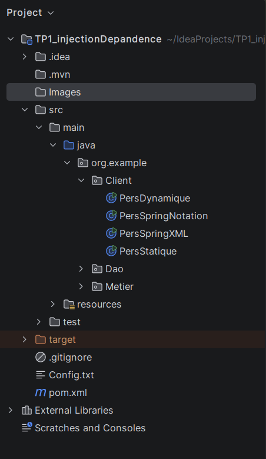
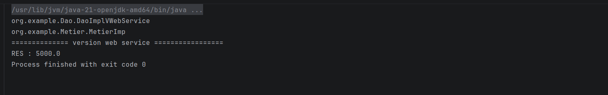

# Activit-Pratique-N-1---Injection-des-d-pendances
## 📌 Description
L'objectif de cette activité est de réaliser une application fermé a la modification ouvert a l'extension (utilisation du couplage faible) et l'injection des dépendances
## 🚀 l'injection des dépendances
Dans cette application j'ai réalisé l'injection des dépandances avec trois mainière :
- Par instanciation statique
- Par instanciation dynamique
- En utilisant le Framework Spring (Version XML, Version annotations)

## 🛠 Technologies
- Java
- Spring

## Installation
```bash
git clone https://github.com/Ilyasse-ben/Activit-Pratique-N-1---Injection-des-d-pendances.git
```
src > main > java > org.example > client puis clique sur run 
## ⚙ Architecteur 


## Résulta 
)

